# BlastMail 📧

**BlastMail** é um sistema completo de envio de e-mail marketing desenvolvido com **PHP** e **Laravel** no curso de Laravel da Rocketseat. Ele permite a criação, agendamento e gerenciamento de campanhas de e-mail de forma eficiente, utilizando filas para garantir desempenho e rastreamento de interações.

---

## 🚀 Funcionalidades

- **Criar Campanhas**: Configurar campanhas de e-mail marketing com facilidade.
- **Personalizar Templates**: Criar e editar templates em HTML para personalizar os e-mails.
- **Gerenciar Listas de E-mails**: Controlar listas manualmente ou via upload de arquivos `.csv`.
- **Enviar E-mails com Filas**: Utilizar o sistema de filas do Laravel para agendar e evitar sobrecarga.
- **Agendar Campanhas**: Programar envios para horários específicos.
- **Rastrear Interações**: Monitorar aberturas e cliques nos e-mails.
- **Visualizar Relatórios de Desempenho**: Acompanhar métricas detalhadas de cada campanha.

---

## 📸 Preview do Projeto

### Tela principal
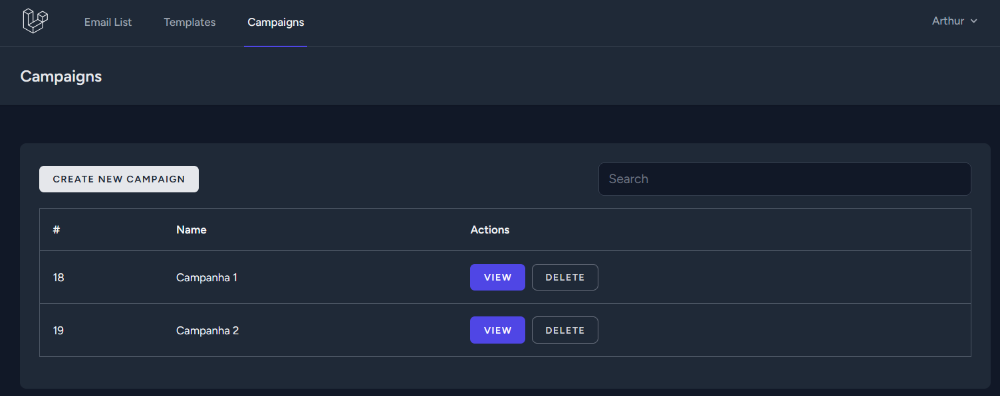

### Lista de E-mails
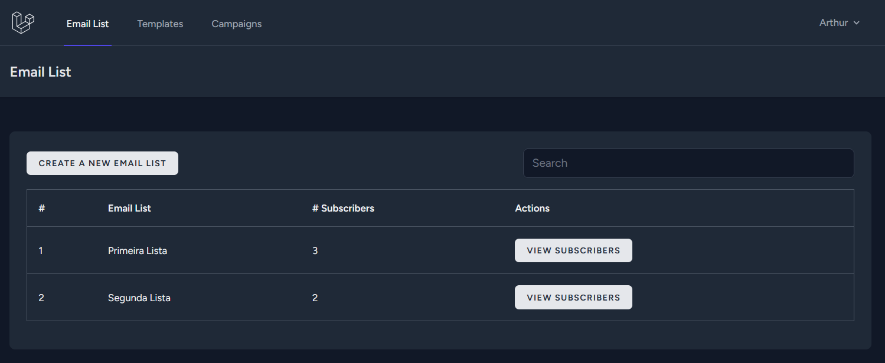

### Criação de Lista de E-mails
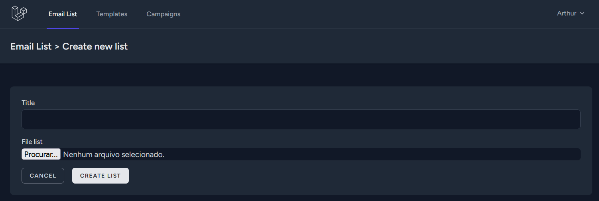

### Visualizar Usuários Lista de E-mails
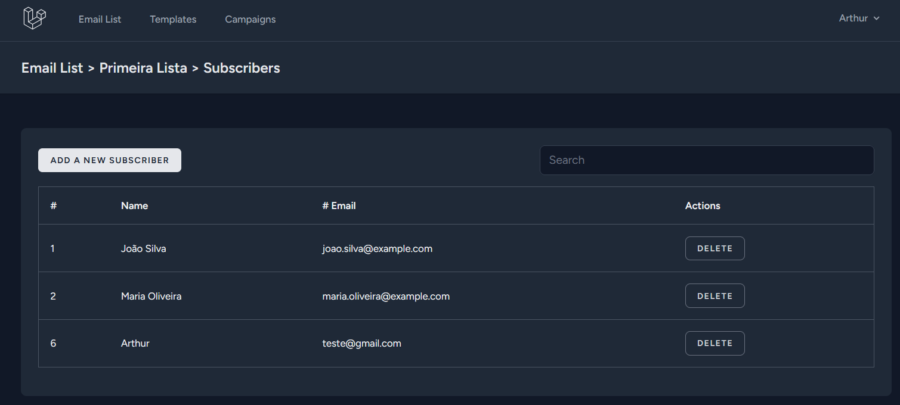

### Template de E-mails
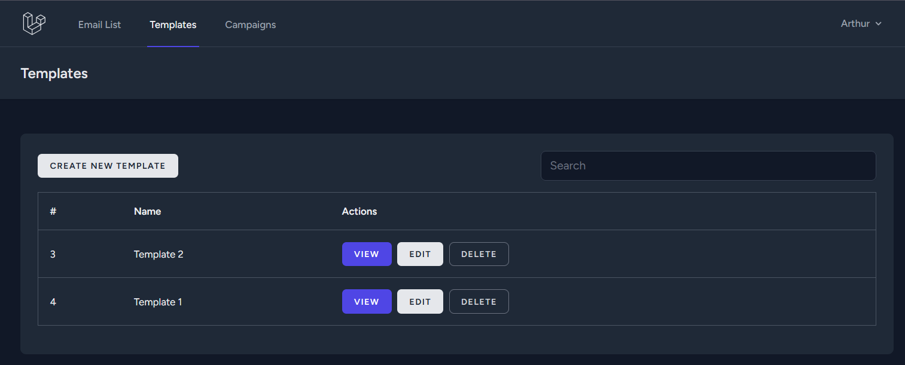

### Criação de Template
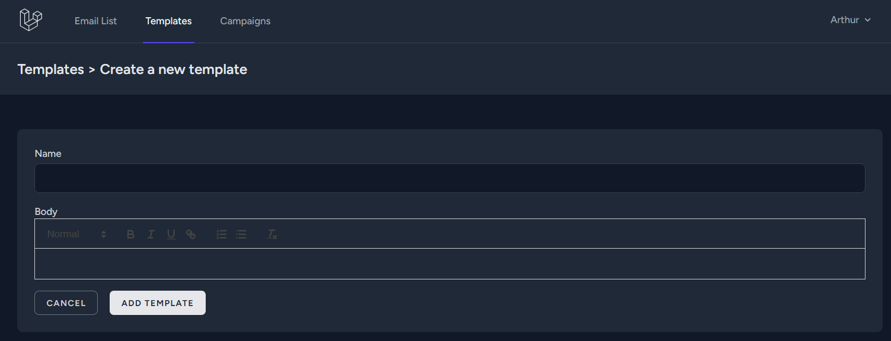

### Visualizar Template
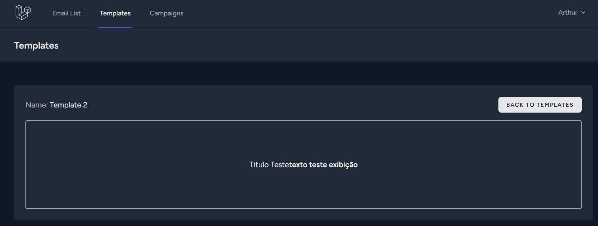

### Criação de Campanha
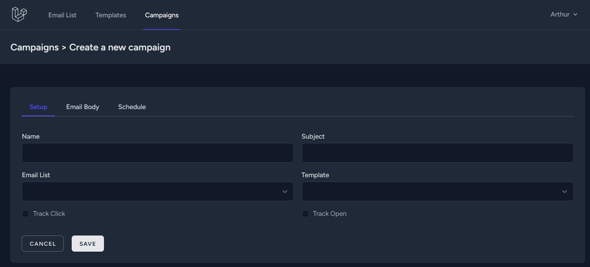

### Review Criação de Campanha 
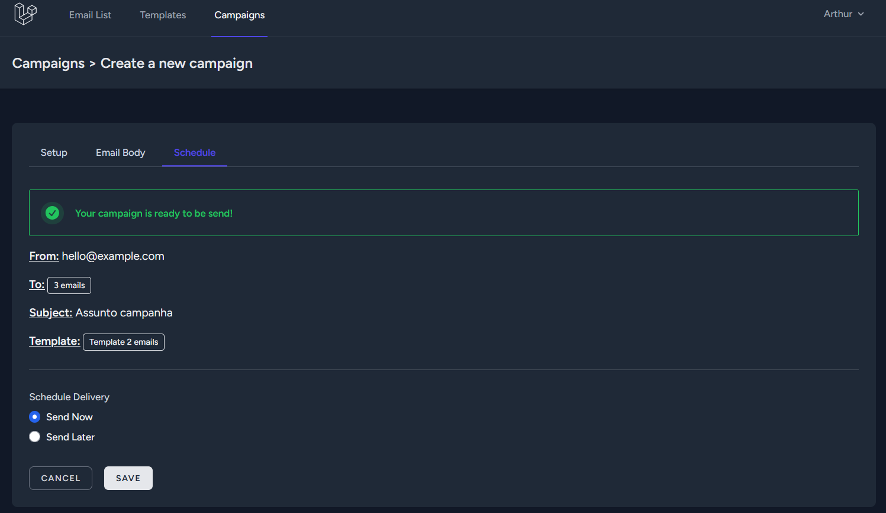

### Estatística da Campanha
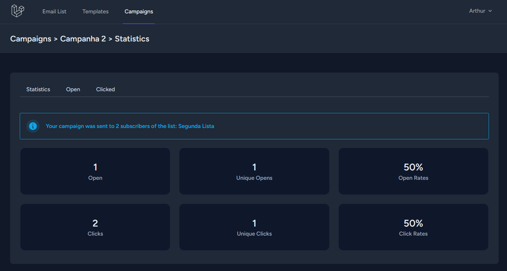

### E-mail disparado
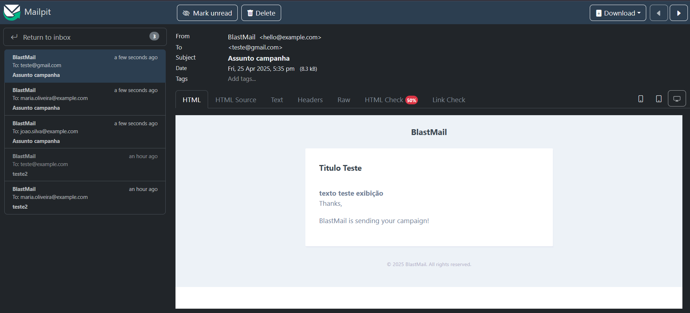